Hello Team,

Here's my take on the assignment!

## 📌 Architecture

# 📄 Rationale  

The proposed solution leverages **Infrastructure as Code (IaC)** to automate the administration of **Databricks Unity Catalog (UC)**. This approach ensures that data governance is **scalable, secure, and auditable**, while minimizing risks associated with manual configuration.  

## 🔑 Key Considerations  
- **Scalability** → Reusable IaC modules allow new teams and domains to be onboarded consistently.  
- **Security & Compliance** → Role-based access via Azure AD enforces least-privilege and regulatory standards.  
- **Auditing** → Git version control provides full change tracking and peer review.  
- **Risk Mitigation** → Automation reduces human error and prevents configuration drift.  

## 📌 Assumptions  
- **Azure AD** is the enterprise identity provider.  
- The **data platform team** has the required Terraform/Bicep skills and manages state securely.  
- **UC templates** are provisioned via Git workflows (pull/merge requests).  
- Broader data platform components include:  
  - **Azure Databricks** → ETL  
  - **Azure Storage Accounts** → Data storage  
  - **Azure Data Factory (ADF)** → Orchestration  
  - **Azure Key Vault** → Secrets & password management  
  - **SQL Server** → Downstream reporting and metadata/process control  

---

# ⚙️ Suggested Automation of Unity Catalog  

UC administration should be automated using **Terraform or Bicep**, integrated with CI/CD pipelines.  

## ✅ Advantages  
- Consistency across environments  
- Version control & change tracking  
- Compliance & security enforcement  
- Scalability & standardization  
- Disaster recovery & reproducibility  

## ⚠️ Disadvantages  
- State file sensitivity (requires secure backend)  
- Limited real-time visibility (manual UI changes cause drift)  
- Change management overhead (all updates flow through PRs)  
- Provider limitations (some UC features may lag in Terraform support)  
- Monolithic repository risk if not modularized  

---

# 🚀 Recommendations  
- **Integrate Azure AD** groups with Unity Catalog for role-based access control.  
- **Define role patterns** such as Data Owners, Stewards, and Analysts.  
- Provision **catalogs and schemas via CI/CD pipelines**, with steward approvals and peer review.  
- Automate **lineage tracking and audit logging** for compliance and monitoring.  
- Enable **self-service onboarding** through templates or PR-driven workflows, reducing manual admin intervention.  

---

# 📊 Diagrams  

### 1. Automation Flow  

```mermaid
flowchart LR
    subgraph DevTeam["👩‍💻 Data Team"]
        A[Submit PR with UC config]
    end

    subgraph GitHub["📂 Git Repository"]
        B[Code Review & Merge]
    end

    subgraph CICD["⚙️ CI/CD Pipeline"]
        C[Terraform/Bicep Apply]
    end

    subgraph Azure["☁️ Azure Platform"]
        D[(Unity Catalog)]
        E[(Azure AD Groups)]
        F[(Audit Logs & Monitoring)]
    end

    A --> B --> C --> D
    E --> D
    D --> F
```

